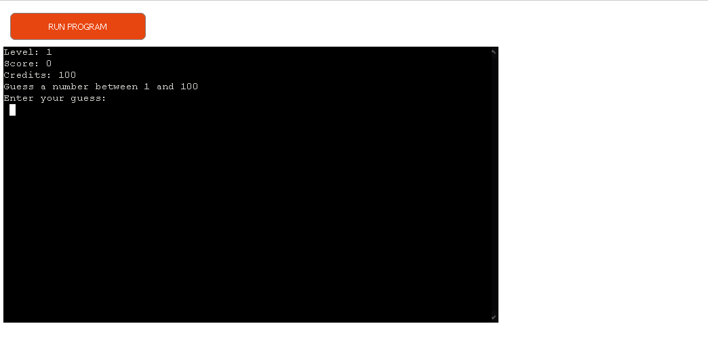
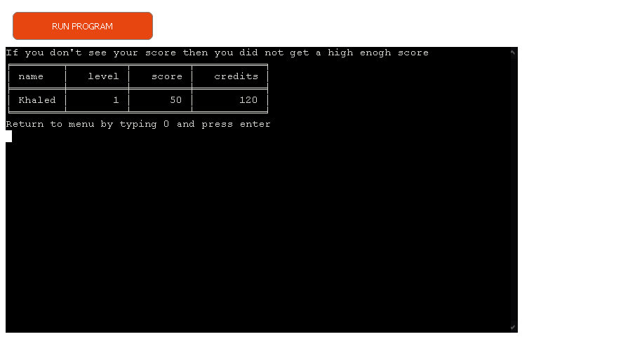
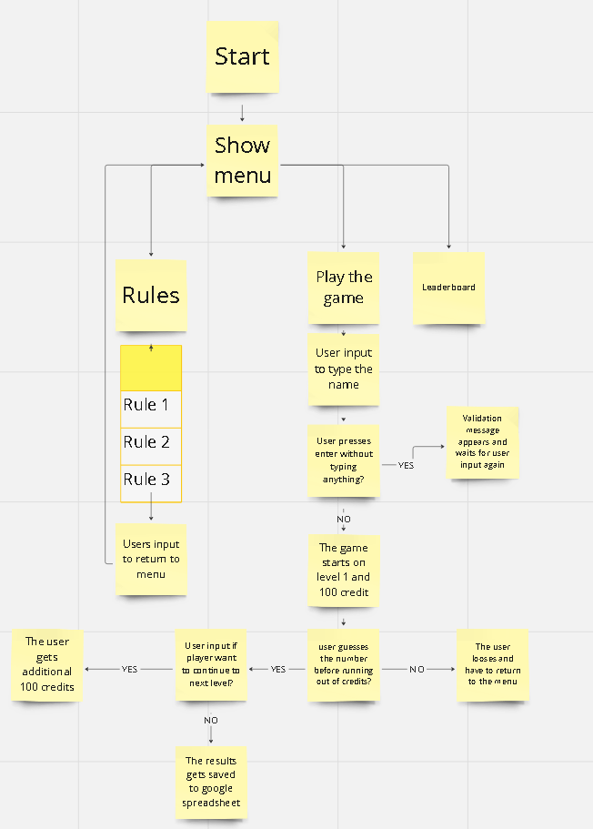

# GuessStreak


*The link to [Guess Streak](https://guessstreak.onrender.com/)*

Guess Streak is a Python terminal project whose primary purpose is to provide various experiences.

Users can quickly learn the rules of the game and play the game. Once the player answers no on do you want to proceed to next level. The results gets saved to google spreadsheet. Only the top 10 players in score are being kept in the sheet

---

## How to play:

  1. Click this *[link](https://guessstreak.onrender.com)* or copy this text: `https://guessstreak.onrender.com` and paste it in your browser's address bar.
  2. As soon as the page is loaded, click 'RUN PROGRAM'.
  3. Learn the rules.
  4. Start by typing 1 and press enter.
  5. On each wrong guess you lose 20 credits.
  6. Once the credits is 0 you lose.
  7. If you choose not to continue by typing no and pressing enter on the question. The results gets saved to google spreadsheet
  8. Only top 10 scores is saved.


  Link to the game: *https://guessstreak.onrender.com*

---

## User Stories
### First Time Visitor Goals:

* As a First Time Visitor, I want to quickly understand the program's primary purpose so that I can learn more about this program.
* As a First Time Visitor, I want to navigate through the program easily so that I can find the content.
* As a First Time Visitor, I want to play the game and have fun.
* As a First Time Visitor, I want to see different text colors so I can easily understand the context.

### Frequent Visitor Goals:
* As a Frequent User, I want to be able to beat the old records and achive a new record so my name is kept name.
---

## Features
  
  - **When the program is loaded**

  The user can see the options to either se the rules or start playing:
  
  


  - **When the user chose "Learn the rules"**

  The user will see the main rules of the game which are required to be followed.
  Below the rules, the user can find the main menu where he or she may choose to return to main menu.

  

  - **When the user chose to play the game**
  The program asks for the player name.
  The user start with 100 creadits.Every wrong guess takes 20 credits. When the user reaches zero credits the player looses.
  On each level completion the player gets 50 points.

  

  - **When the user chose to see the leaderboard**
  The results is shown in a table that looks nice .

  

---

## Flowchart

The flowchart represents the logic of the application:

  


---


## Technologies Used

### Languages:

- [Python 3.8.5](https://www.python.org/downloads/release/python-385/): used to anchor the project and direct all application behavior

- [JavaScript](https://www.javascript.com/): used to provide the start script needed to run the Code Institute mock terminal in the browser

- [HTML](https://developer.mozilla.org/en-US/docs/Web/HTML) used to construct the elements involved in building the mock terminal in the browser

### Frameworks/Libraries, Programmes and Tools:
#### Python modules/packages:

##### Standard library imports:

- [random](https://docs.python.org/3/library/random.html) was used to implement pseudo-random number generation.
- [os](https://docs.python.org/3/library/os.html ) was used to clear the terminal.
##### Third-party imports:

- [google.oauth2](https://developers.google.com/identity/protocols/oauth2/javascript-implicit-flow) was used for authentication.
- [colorama](https://pypi.org/project/colorama/) was used to add color to the terminal.
- [gspread](https://docs.gspread.org/en/v5.12.1/) was used to interact with Google Sheets

#### Other tools:

- [VSCode](https://code.visualstudio.com/) was used as the main tool to write and edit code.
- [Git](https://git-scm.com/) was used for the version control of the website.
- [GitHub](https://github.com/) was used to host the code of the website.
- [GIMP](https://www.gimp.org/) was used to make and resize images for the README file.
- [Miro](https://miro.com/) was used to make a flowchart for the README file.
- [render.com](https://render.com/) was used to deploy the project.

---

## Bugs

+ **Solved bugs**
1. On saving the results to the sheet it used to save 11 rows even though the max was 10. I had to add a for loop and stop it when it reaches 10 rows
  ```
    for row, index in enumerate(top_10_data):
        Blad1.append_row(index)
        if row == 9:
            print("Results are saved...")
            time.sleep(1.0)
            validation.clear_console()
            return
  ```
  
2. The input validation on some parts of the application were bad and sometimes it crashed the app.

+ **Unsolved bugs**

    None
---
## Testing

Please refer to the [TESTING.md](TESTING.md) file for all test related documentation.

---
## Deployment

### To deploy the project to Render so it can be run as a remote web application:
Link to the deployed application on Render: [The Maddest Madlib](https://the-maddest-madlib.onrender.com)

1. Create a new Render account if you don't already have one here [Render](https://render.com/).

2. Create a new application on the following page here [New Render App](https://dashboard.render.com/), choose **Webserver**:

    - 

3. Select the GitHub option and connect the application to the repository you created.

    - 

4. Search for the repository you created and click "Connect."

    - 

5. Create name for the application

    - 

6. Select the region where you want to deploy the application.

    - 

7. Select branch to deploy.

    - 

8. Select environment.

    - 

9. Render build command: `pip3 install -r requirements.txt && npm install`

    - 

10. Render start command: `node index.js`

    - 

11. Select Free plan.

    - 

12. Add the following environment variables:

    - Key: GOOGLE_SHEETS_CREDS_JSON
    - Value: the content of the file you get when creating or using Google Sheets API

    - 

13. Click "Create Web Service."

    - 

14. Wait for the completion of the deployment.


---
## Credits

- Color formatting: [Colorama](https://pypi.org/project/colorama/).
- [Miro](https://miro.com) for creating the flowchart.
- [Github](https://github.com) for storing the code.
- [Render](https://render.com/) for hosting the application.
- [Google](https://google.com/) for storing the results in a spreadsheet.

---
## Acknowledgements

[Iuliia Konovalova](https://github.com/IuliiaKonovalova)
I am thankful to my mentor Iuliia Konovalova for her guidance and valuable feedback!

[codeinstitute](https://codeinstitute.net/se/)
I am thank to Code Institue for providing the template for the project to use!