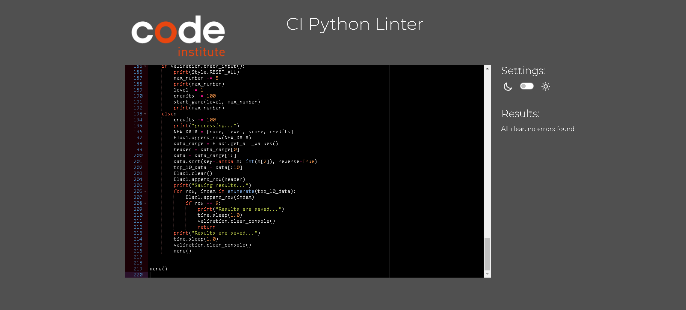
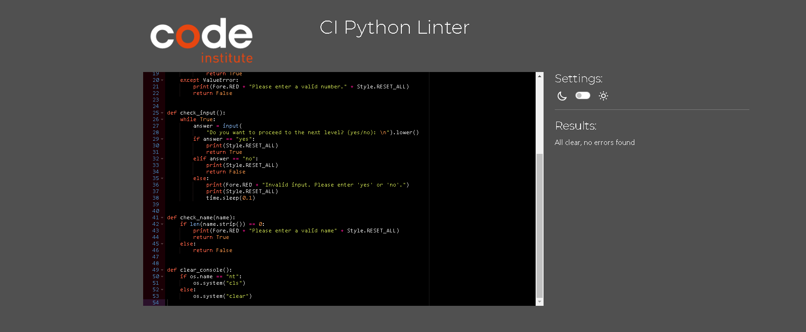
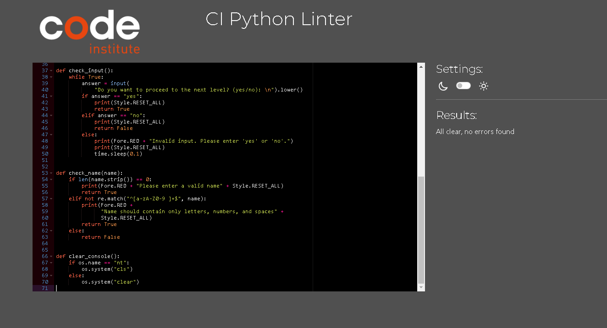
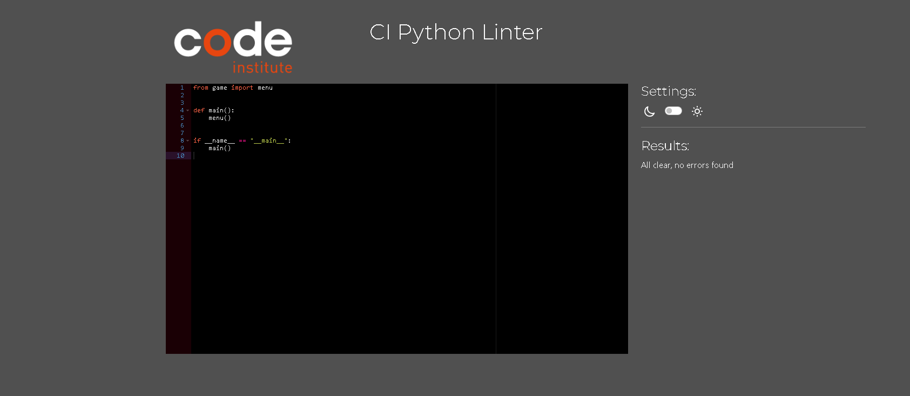
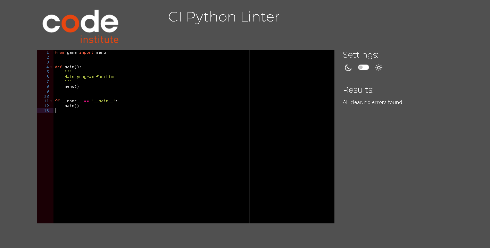

Return back to the [README.md](README.md) file.

## Testing

The program was tested constantly during its development process.
Other users also tested it in order to spot possible grammatical mistakes that the code may present.

### Validators

The code is pep8 compliant .The validation was done by copying python code and pasting it into the validator [pep8ci](https://pep8ci.herokuapp.com/).

No errors were found:

- **game.py**

- **validation.py**

- **run.py**

